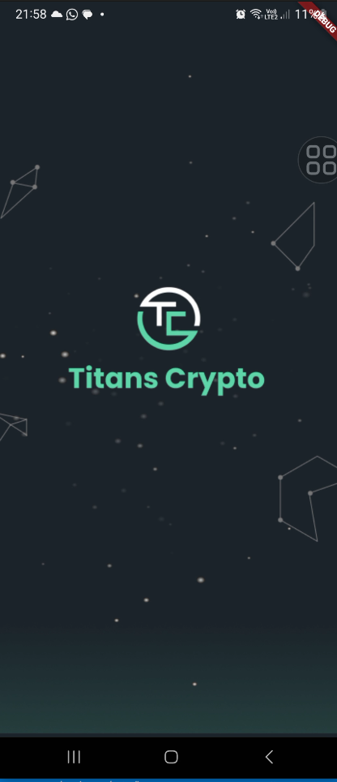
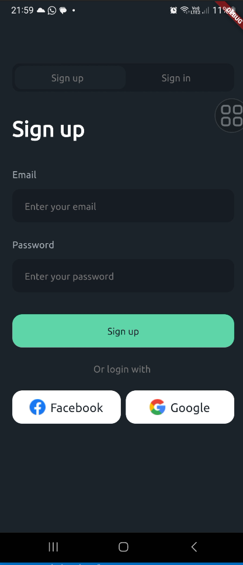
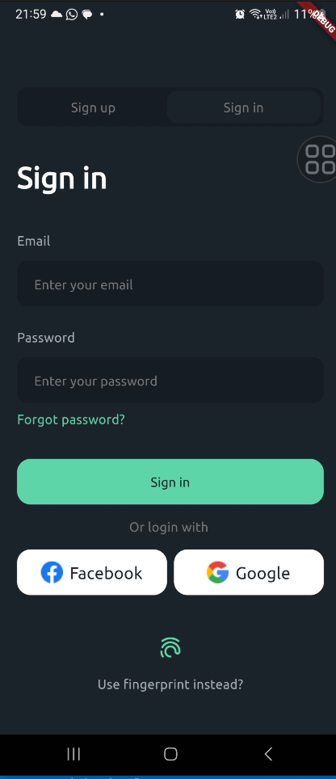
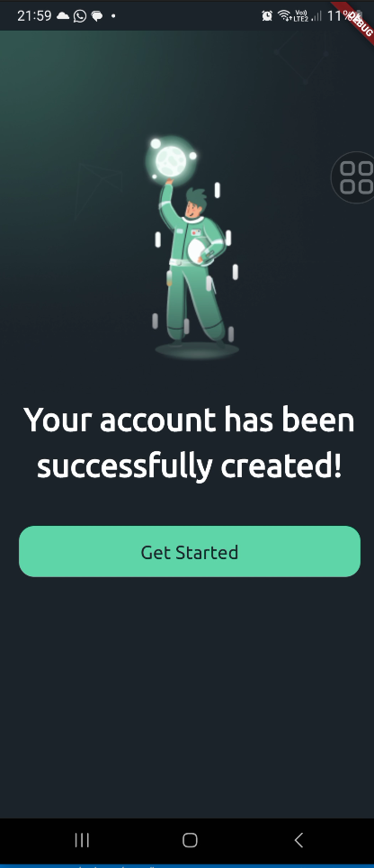

# :pencil2: titan_crypto

Projeto de criptomoedas feito em flutter.

https://github.com/EdsonMello-code/titan_crypto/assets/55053346/99520582-26ba-4be6-a679-342fb82c9412

## :heavy_check_mark: Telas do projeto

## :computer: Tecnologias, APIs, Packages utilizados:
      
  * Flutter / Dart
  * go_router
  * google_fonts
  * geolocator
  * local_auth

